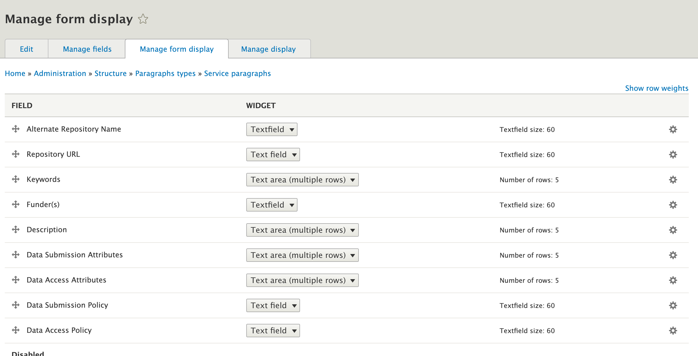
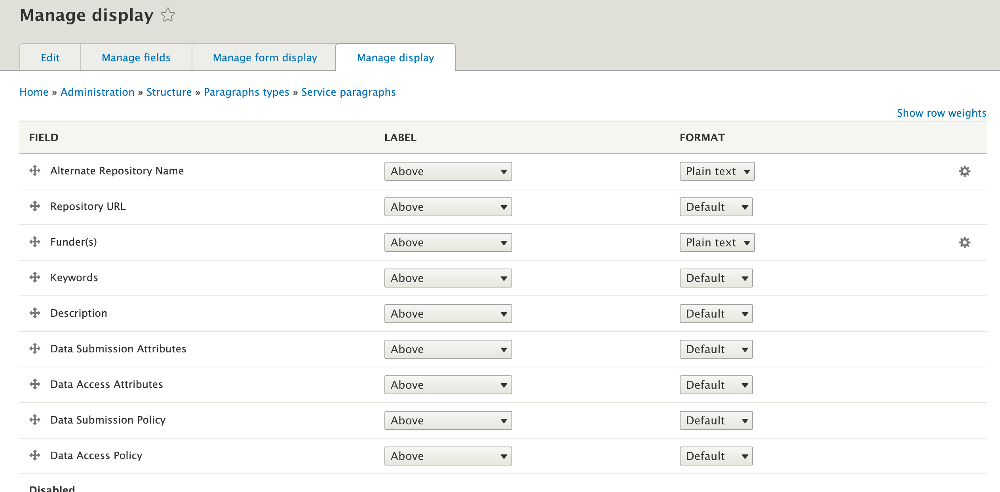

# Introduction
This is a drupal 8 custom module for importing (via drupal migration) NYU HSL Data Storage Finder site data into any 
[CD-Finder](https://github.com/CU-CommunityApps/CD-finder) installation.

# Getting Started
## Prerequisites
You will need the following things properly installed on your server.
- drupal 8
- [Cornell's CD-Finder module](https://github.com/CU-CommunityApps/CD-finder)
## Installation
1. Install via composer ```composer require nyuhsl/migrate_nyu_hsl_drf_data``` **OR** 
clone this repository into your Drupal 8 site's custom module directory (e.g. /var/www/html/drupal8/modules/custom)


2. Enable the module via drush ```drush en -y migrate_nyu_hsl_drf_data``` **OR** via drupal's admin UI at /admin/modules 


3. Run the migrations all at once via drush ```drush mim --group=nyu_hsl_drf_data_migrations --execute-dependencies```
   **OR** via admin UI at /admin/config/services/migrate_nyu_hsl_drf_data/migrate in the following order:
   - nyu_hsl_drf_taxonomy_control_types
   - nyu_hsl_drf_taxonomy_facets
   - nyu_hsl_drf_service_paragraphs
   - nyu_hsl_drf_service_contents


4. Disable the following default fields provided by the CD-Finder module from /admin/structure/paragraphs_type/service_paragraphs/form-display
   - "First Category"
   - "Second Category"

   Next, enable the rest of the fields provided by this module in the following order (shown in the image below) & hit "Save":
   - "Alternate Repository Name"
   - "Repository URL"
   - "Keywords"
   - "Funder(s)"
   - "Description"
   - "Data Submission Attributes"
   - "Data Access Attributes"
   - "Data Submission Policy"
   - "Data Access Policy"


   

5. Repeat Step 4 from /admin/structure/paragraphs_type/service_paragraphs/display (shown in the image below) & hit "Save":
   - "First Category"
   - "Second Category"

   Next, enable the rest of the fields provided by this module in the following order (shown in the image below) & hit "Save":
   - "Alternate Repository Name"
   - "Repository URL"
   - "Keywords"
   - "Funder(s)"
   - "Description"
   - "Data Submission Attributes"
   - "Data Access Attributes"
   - "Data Submission Policy"
   - "Data Access Policy"
   

   
   
6. Visit "/finder" of your site url.